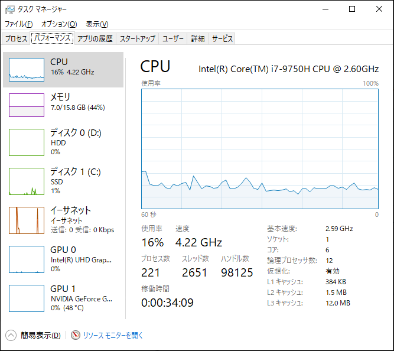
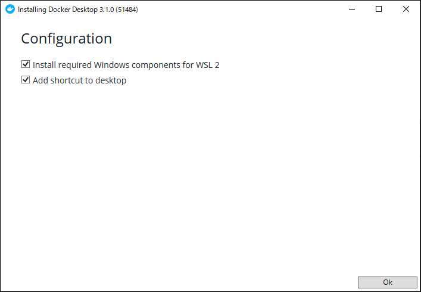

# Docker Desktop を Windows 10 Home の WSL 2 環境に導入する

## 概要

Windows 10 Home の場合、Ver. 1909 以前の場合は、Docker コンテナを動かすのに、
Docker Toolbox しか使えない。

Docker Toolbox は、VirtualBox が必要になる。
VirtualBox の Default という VM の上で Docker コンテナを動かす形になる。

ただし、VirtualBox の VM は、プロビジョニングが必要なため、起動に時間が掛かる。

ところが、OS が Ver. 2004 以降になると、Docker Desktop という
別の Docker GUI ツールが利用可能になる。

Docker Desktop は、WSL 2 の Linux 上で Docker コンテナを動かす形になる。

## 環境

- Windows Home 10
- Ver. 2004 以降

## WSL 2 のインストール

まず最初に WSL 2 をインストールする。

### Enable Virtualization  

WSL 2 を起動するためには CPU の Virtualization が有効化されている必要がある。

タスクマネージャーを開いて パフォーマンス > CPU 画面から、 **仮想化: 有効**（Virtualization: Enabled）になっていることを確認する。

もし有効（Enabled）になっていない場合は Bios を開いて CPU Configuration > Intel (AMD) Virtualization Technology: Enabled にする。



## Enable Windows Feature

管理者モードで PowerShell を起動して次の 2 つのコマンドを実行します。再起動しないと機能が有効にならないため、コマンドを実行後に再起動する。

```console
Enable-WindowsOptionalFeature -Online -FeatureName Microsoft-Windows-Subsystem-Linux
Enable-WindowsOptionalFeature -Online -FeatureName VirtualMachinePlatform
```

### WSL 2 kernel のインストール

次のページから WSL2 Linux kernel update package for x64 machines（wsl_update_x64.msi）をダウンロードする。ダウンロードした msi ファイルを実行する。

### WSL 2 をデフォルトバージョンにする

PowerShell を開き、次のコマンドを実行して、新しい Linux ディストリビューションをインストールするときに WSL 2 をデフォルトバージョンとして設定する。

```console
wsl --set-default-version 2
```

### Linux ディストリビューションをインストール

Microsoft Store から次の Linux ディストリビューションをインストールする。

```
Ubuntu 20.04 LTS
```

### Linux ディストリビューションの起動

新しくインストールした Linux ディストリビューションを初めて起動すると、コンソールウィンドウが開き、ファイルが解凍されて PC に保存されるまで 1 ～ 2 分待つように求められる。
今後のリリースはすべて 1 秒未満で完了する。

```
Installing, this may take a few minutes...
```

次に、新しい Linux ディストリビューションのユーザーアカウントとパスワードを作成する必要がある。

```console
Please create a default UNIX user account. The username does not need to match your Windows username.
For more information visit: https://aka.ms/wslusers
Enter new UNIX username: 
New password:
Retype new password:
passwd: password updated successfully
Installation successful!
```

### Winsows Terminal への登録

Windows Terminal を利用している場合は、Ubuntu コンソールを Windows Terminal に登録する。


Terminal の設定への登録には GUID が必要なので、PowerShell で次のコマンドを実行して GUID を取得する。

```console
[Guid]::NewGuid()
```

実行結果例:
```
Guid
----
8a2e8c53-c638-3716-7c74-c830c73e3a3a
```

### WSL 2 の設定、実行確認

インストールした Ubuntu で WSL 2 を利用するコマンドを実行できるか、PowerShell で次のコマンドを実行する。

```console
wsl --set-default-version 2
wsl --set-version Ubuntu-20.04 2
```

```
  NAME            STATE           VERSION
* Ubuntu-20.04    Running         2
```

## Docker のインストール

WSL 2 をインストールできたら、次は Docker をインストールする。

### Docker Desktop のインストール

次のページから Docker Desktop のインストーラ（Docker Desktop Installer.exe）をダウンロードする。

Docker Desktop  
https://www.docker.com/products/docker-desktop

ダウンロードしたインストーラを実行する。 インストールの途中で表示される Configuration は `Enable WSL 2 Windows Features` のチェックを外さないようにする。


